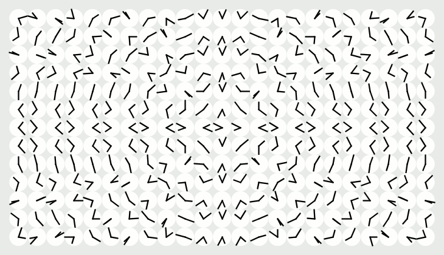

# times

A attempt to create a loopable gif based on this: http://imgur.com/gallery/bbCjfiU
originally by http://www.humanssince1982.com/a-million-times

Credit for the processing base script that I continued to tweak and modify goes to the imgur user goldcode

